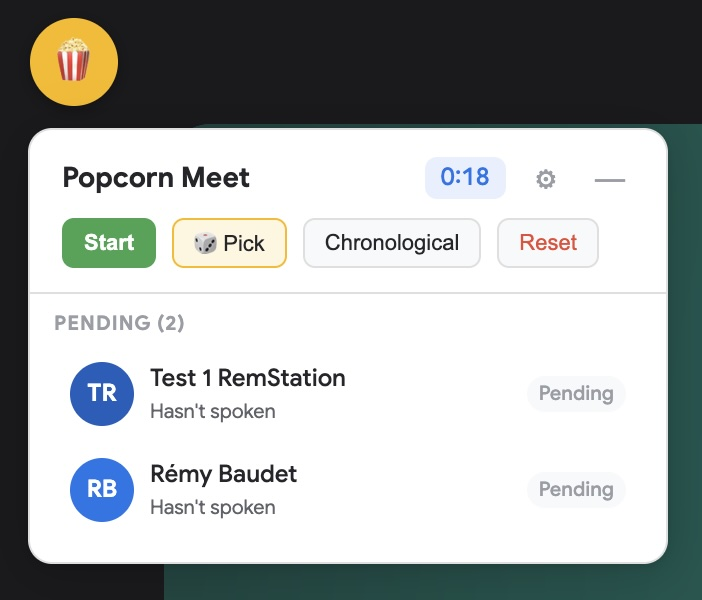
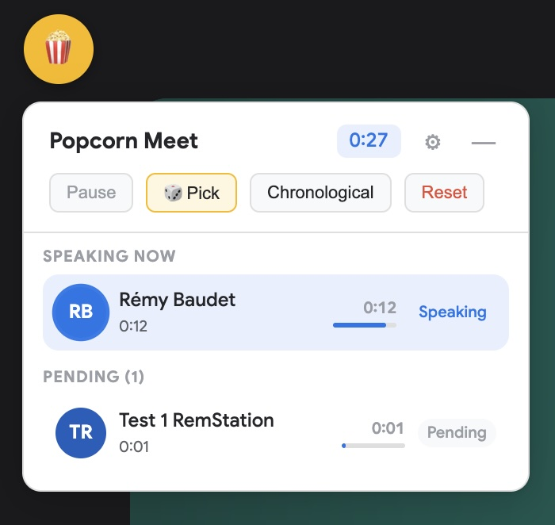
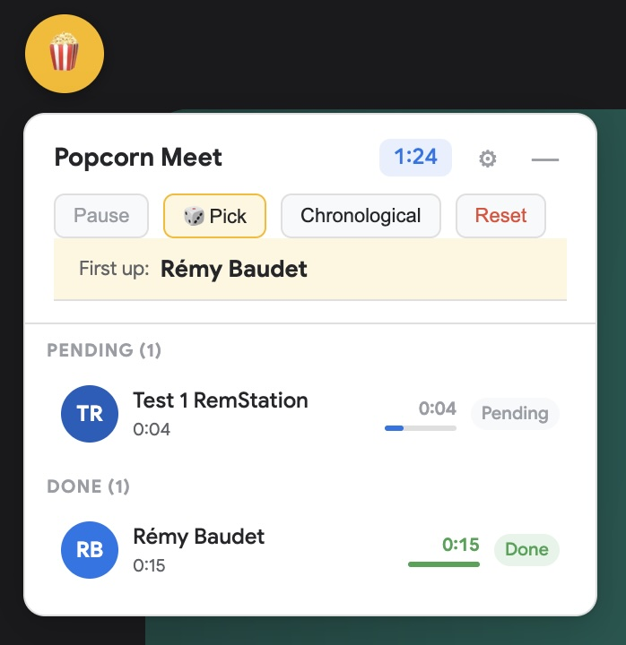
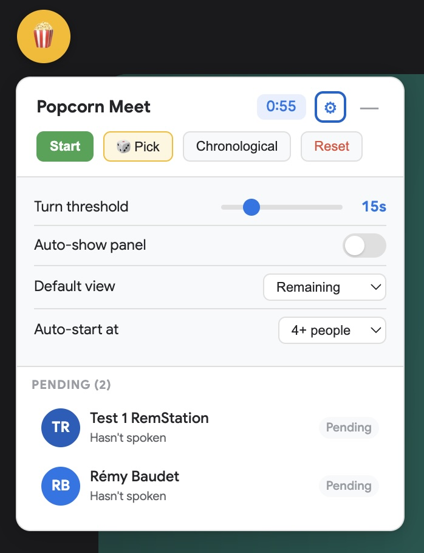

# Popcorn Meet

A Chrome extension that tracks speaking order during Google Meet standups — no audio capture, no permissions beyond storage.



## How it works

Google Meet visually highlights the active speaker's tile via CSS class changes. Popcorn Meet uses a MutationObserver to detect rapid class mutations on participant tiles, identifying who's speaking based on mutation frequency analysis. No microphone access needed.

## Features

- **Speaker detection** — automatically detects who's speaking via DOM observation
- **Popcorn order tracking** — records who spoke, in what order, and for how long
- **Random picker** — randomly select who goes first
- **Turn threshold** — configurable minimum speaking time to count as a "standup update" (default 15s). Short comments/reactions don't count.
- **Start/Pause** — manual control over when tracking begins, so pre-meeting chat doesn't pollute the data
- **Auto-start** — optionally start tracking when N+ participants join
- **Two views** — "Remaining" (speaking/pending/done groups) and "Chronological" (order of first speech)
- **Floating panel** — draggable widget injected into Meet's page via Shadow DOM. Works in regular tabs and the Google Meet PWA.
- **Settings** — turn threshold, auto-show, default view, auto-start threshold, FAB position — all persisted via `chrome.storage.sync`
- **Dark mode** — follows system preference

## Install

1. Clone this repo:
   ```
   git clone https://github.com/Statyk7/popcorn-meet.git
   ```
2. Open `chrome://extensions` in Chrome
3. Enable **Developer mode** (toggle in top-right)
4. Click **Load unpacked** and select the `popcorn-meet` folder
5. Join a Google Meet call — a popcorn button appears in the top-left corner

## Usage

1. **Join a Meet call** — the popcorn floating button appears
2. **Click the button** to open the tracking panel
3. **Click "Pick"** to randomly select who starts
4. **Click "Start"** when your standup begins (or configure auto-start in settings)
5. As people speak, they move from Pending → Speaking → Done
6. The progress bar fills up toward the turn threshold — turns green when met
7. **Click "Pause"** to stop tracking, **"Reset"** to start fresh

| Speaking detection | Done + random pick |
|---|---|
|  |  |

## Settings (gear icon)



| Setting | Description | Default |
|---------|-------------|---------|
| Turn threshold | Seconds of speaking to count as a completed turn | 15s |
| Auto-show panel | Automatically open the panel when joining a meeting | Off |
| Default view | Start in "Remaining" or "Chronological" mode | Remaining |
| Auto-start at | Auto-start tracking when N+ participants join | Off |

## File structure

```
popcorn-meet/
├── manifest.json    # MV3 manifest
├── content.js       # Speaker detection + floating panel UI
├── panel.css        # Panel styles (loaded into Shadow DOM)
├── background.js    # Extension icon click handler
├── assets/          # Screenshots
└── icons/
    └── icon128.png
```

## Technical notes

- **Speaker detection**: Meet applies rapidly-toggling CSS classes to the active speaker's tile (~5 changes/second for audio level visualization). The extension counts class mutations per tile in a 2-second sliding window — the tile with 6+ mutations spread across 800ms+ is the speaker.
- **Name extraction**: Participant names are pulled from the `"More options for <Name>"` aria-label pattern on buttons inside each tile.
- **Shadow DOM**: The panel is injected into Meet's page inside a closed Shadow DOM, preventing style conflicts in both directions.
- **No special permissions**: Only `storage` permission is required. No audio, no microphone, no tabs.

## Limitations

- Only works with Google Meet (meet.google.com)
- Speaker detection relies on Meet's current DOM structure — may need updates if Google changes Meet's UI significantly
- Cannot distinguish between two people speaking simultaneously (shows the one with more class mutations)

## License

MIT
